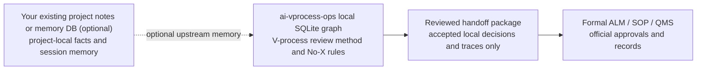

# Reviewable AI-Assisted Engineering

## ai-vprocess-ops: a small SQLite graph that captures why AI-generated code exists

[](https://github.com/enzoferraripapa-arch/ai-vprocess-ops/actions/workflows/ci.yml)
[](https://github.com/enzoferraripapa-arch/ai-vprocess-ops/actions/workflows/security.yml)

AI wrote the code. Where's the why? AI coding agents can build fast, but the
engineering reason behind the work often disappears across sessions.

This repository is a small, executable reference architecture for preserving
that reason as a local SQLite graph: requirements, decisions, trace candidates,
tests, evidence, open issues, policy triggers, standards references, and ALM
handoff rationale.

Existing project notes or memory DBs can feed this method as optional upstream
sources. The repository itself stays focused on the V-process / pre-ALM method
layer.

It is designed for Codex, Claude Code, Cursor, GitHub Copilot, or another AI
coding agent when the bottleneck is no longer code generation speed, but the
loss of engineering context.

```text
Model weights stay fixed.
Engineering state lives in the database.
The LLM reads the graph and drafts bounded recommendations.
Humans and formal ALM systems keep final authority.
```



## Boundary

This is:

- a graph-backed engineering-memory pattern;
- a pre-ALM review and decision-support layer;
- a build specification for AI agents that need project-specific importers,
  reverse-engineering passes, review reports, and handoff packages;
- a dependency-free Python prototype that proves the operating path.

This is not:

- model training or fine-tuning;
- automatic compliance;
- a replacement for human engineering judgement;
- a packaged generic project-memory database;
- a replacement for Polarion, DOORS, Jama, Codebeamer, or another formal ALM
  system;
- a tool for unauthorized third-party reverse engineering, DRM bypass,
  credential extraction, or secret discovery.

Local accepted decisions and reviewed traces are local review records only.
Formal approvals, baselines, signatures, workflow state, and audit records stay
in the formal ALM or SOP system.

The repository includes application examples, but they are examples only. If
you use this pattern to develop, review, release, sell, certify, operate, or
maintain anything, the engineering decisions and consequences remain yours. See
[docs/16_application_examples_and_responsibility.md](docs/16_application_examples_and_responsibility.md).

## What Works Today

The prototype is intentionally small, but it is executable end to end.

| Capability | Current implementation |
| --- | --- |
| Build graph memory | `prototype/vprocess_graph.py` loads fictional project/change data into SQLite. |
| Reverse-engineering import | `prototype/import_reverse_engineering.py` imports authorized sample behavior, requirement candidates, trace candidates, evidence, and open issues. |
| Policy matching | `prototype/policy_match.py` supports single-condition and AND-condition activity policies. |
| Impact analysis | `prototype/impact_query.py` uses a recursive SQLite CTE with depth and edge filters. |
| LLM review context | `prototype/llm_recommend.py` builds bounded graph context and can call local Ollama. |
| Human decision lifecycle | `prototype/decision_lifecycle.py` records accepted, rejected, draft, and needs-review states with reviewer, rationale, and timestamps. |
| Reviewed handoff | `prototype/alm_handoff_export.py` exports Markdown or JSON from accepted decisions and accepted trace reviews only. |
| Review report | `prototype/export_review_report.py` writes deterministic Markdown from the graph. |
| Read-only tool boundary | `prototype/mcp_readonly_stub.py` exposes JSON-RPC-style read-only graph tools. |
| Regression check | `benchmarks/run_sample_regression.py` verifies the fictional sample scenario and committed outputs. |

Current limits: this is not a production trace engine, complete MCP server,
GraphRAG system, Neo4j-style graph platform, formal ALM adapter, or real
quality/cost benchmark. It is a compact reference implementation with explicit
extension points.

## Quick Start

From the repository root:

```bash
python prototype/vprocess_graph.py --db .demo/vprocess_demo.db --input examples/sample_project_input.json
python prototype/llm_recommend.py --db .demo/vprocess_demo.db --provider prompt
python benchmarks/run_sample_regression.py
```

The first command creates a local demo graph from fictional data. The second
builds the LLM review prompt from that graph without calling a remote model.
The third runs the deterministic sample regression check.

For the full executable path, including impact query, decision review,
trace-review handoff, report export, and read-only tool listing, see
[docs/12_architecture.md](docs/12_architecture.md).

For AI-agent operating instructions, read [AGENTS.md](AGENTS.md).

## Sample Outputs

Committed sample outputs are regenerated and checked by CI:

- [examples/outputs/sample_impact_query.md](examples/outputs/sample_impact_query.md)
- [examples/outputs/sample_review_report.md](examples/outputs/sample_review_report.md)
- [examples/outputs/sample_alm_handoff.md](examples/outputs/sample_alm_handoff.md)
- [benchmarks/sample_result.md](benchmarks/sample_result.md)

## Applied Companion

For a vendor-neutral applied example playbook, see
[ai-vprocess-playbook](https://github.com/enzoferraripapa-arch/ai-vprocess-playbook).

Use this repository for the abstract pattern and executable prototype. Use the
playbook for small operational examples such as project profiles,
work-item-like SOP skeletons, gate and trace reviews, connector permission
boundaries, and routing matrices. The playbook is still an example set, not an
approval, compliance, or certification package.

## For AI Agents

Use this repository as a build specification, not as a place to store private
project state.

Give an AI coding agent:

1. this repository;
2. an authorized target project;
3. the target project's allowed artifacts, tests, logs, documents, and
   configuration;
4. a clear boundary for what may be inferred and what requires human review.

Then ask it to build a local engineering-memory pipeline:

- artifact inventory;
- graph importer;
- reverse-engineering pass for observed behavior and candidates;
- V-process activity recommendation;
- trace candidate generation;
- human review report;
- one-way ALM handoff package.

Prompt examples are in
[docs/10_ai_agent_build_spec.md](docs/10_ai_agent_build_spec.md).

For a copyable per-project starter workspace, use
[templates/empty_environment](templates/empty_environment). It gives an agent a
local graph DB schema, project profile, bootstrap scripts, and first-request
template without mixing private project data into this public repository.

If you already use a generic engineering-memory DB, treat it as an external
per-project memory layer and this repository as the V-process / pre-ALM method
layer. This repository does not require both layers for every project. See
[docs/17_relationship_to_generic_engineering_memory_db.md](docs/17_relationship_to_generic_engineering_memory_db.md).

## Who This Is For

- Engineers using AI coding agents on long-running projects.
- Vibe coders who need to recover why generated code exists.
- Reviewers of AI-generated pull requests.
- Teams preparing trace candidates, evidence, and review packages before
  formal ALM entry.
- Builders of local-first agent memory, MCP-style tools, context engineering,
  requirements-as-code, and traceability tooling.

The useful claim is narrow:

```text
AI-assisted engineering needs a durable graph of why, not only faster generation
of what.
```

## Repository Layout

```text
AGENTS.md
  Operating instructions for AI coding agents.

docs/
  Concept, architecture, operating model, prompt examples, and positioning.

schema/
  Minimal SQLite schema for the graph, policy, decision, and review layer.

examples/
  Fictional input data and deterministic sample outputs.

prototype/
  Dependency-free Python demo using SQLite.

tests/
  Standard-library unit tests for the Python prototype.

tools/
  Public safety and sample-output checks.

benchmarks/
  Deterministic sample regression check. Not a cost benchmark.

templates/empty_environment/
  Copyable per-project workspace for local engineering-memory runs.
```

## Docs

- [docs/01_concept.md](docs/01_concept.md): operating concept.
- [docs/02_learning_vs_external_memory.md](docs/02_learning_vs_external_memory.md): why this is external memory, not training.
- [docs/03_v_process_decision_graph.md](docs/03_v_process_decision_graph.md): graph, decision, and trace-review model.
- [docs/04_cost_reduction_model.md](docs/04_cost_reduction_model.md): cost-reduction framing and evidence boundary.
- [docs/05_publication_checklist.md](docs/05_publication_checklist.md): public-release checks.
- [docs/06_vibe_coding.md](docs/06_vibe_coding.md): why this also matters outside regulated projects.
- [docs/08_related_work_and_positioning.md](docs/08_related_work_and_positioning.md): nearby tools and positioning.
- [docs/09_reverse_engineering_workflow.md](docs/09_reverse_engineering_workflow.md): authorized legacy recovery workflow.
- [docs/10_ai_agent_build_spec.md](docs/10_ai_agent_build_spec.md): prompts for project-specific implementation.
- [docs/11_distribution_plan.md](docs/11_distribution_plan.md): launch order and audience boundary.
- [docs/12_architecture.md](docs/12_architecture.md): executable path and responsibility split.
- [docs/13_mcp_integration.md](docs/13_mcp_integration.md): read-only JSON-RPC-style tool boundary.
- [docs/14_validation_log.md](docs/14_validation_log.md): Windows and Dell Ubuntu validation notes.
- [docs/15_no_x_rule_pattern.md](docs/15_no_x_rule_pattern.md): negative boundary rules that keep candidates from being mistaken for records, approvals, gate passes, or accepted traceability.
- [docs/16_application_examples_and_responsibility.md](docs/16_application_examples_and_responsibility.md): example-use cases and the plain-language responsibility boundary.
- [docs/17_relationship_to_generic_engineering_memory_db.md](docs/17_relationship_to_generic_engineering_memory_db.md): how this V-process method relates to a generic per-project engineering-memory DB.
- [docs/18_abstraction_levels_and_architecture_review.md](docs/18_abstraction_levels_and_architecture_review.md): abstraction-level and architecture-review controls for AI-generated artifacts.
- [docs/19_design_thinking_decomposition_rules.md](docs/19_design_thinking_decomposition_rules.md): design-thinking operations, failure modes, and review prompts for inspectable AI-assisted design.

## Quality Gates

The repository keeps the first safety layer simple and auditable:

```bash
python -m unittest discover -s tests
python tools/check_public_safety.py
python tools/check_sample_outputs.py
```

GitHub Actions also runs Python compile checks, unit tests across supported
Python versions, sample-output sync checks, Ruff, Bandit, CodeQL, Dependency
Review, and Dependabot.

The public gate rejects common publication accidents: committed SQLite
databases, private-key-like material, token-like strings, internal project
markers, invalid JSON, stale sample outputs, broken SQL schema loading, broad
workflow permissions, `pull_request_target`, and workflows that require
repository secrets.

Before publishing or tagging a release, also run the full command set in
[AGENTS.md](AGENTS.md).

## Public Release Rules

- Use fictional or sanitized examples only.
- Do not publish real customer requirements, proprietary SOPs, tokens, server
  names, internal hostnames, private DB files, or confidential standards text.
- Keep standards references as clause IDs and short original summaries.
- Treat the architecture as decision support, not autonomous compliance
  authority.
