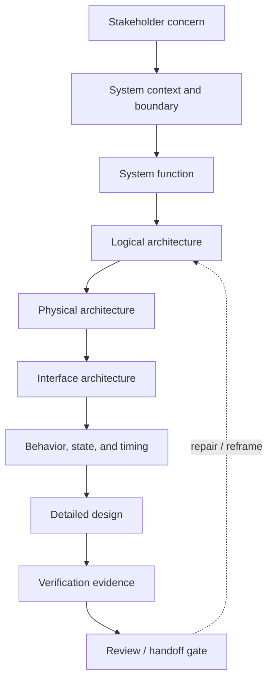

# Abstraction Levels And Architecture Review

- Document ID: `AIVPROC-ARCH-REVIEW-018`
- Trace role: architecture/design review pattern for abstraction-level,
  viewpoint, interface, behavior, evidence, and operation checks.
- Boundary: `NO-ARCHITECTURE-RATIONALE-AS-PROOF`

AI-assisted engineering becomes hard to review when requirements, architecture,
design, implementation, and evidence are written at mixed levels.

This document is a sanitized public pattern for keeping architecture and design
artifacts reviewable. It is not a standard, not a tool-specific configuration,
and not a complete systems-engineering method.

## Core Question

Before accepting an AI-generated artifact, ask:

```text
What level is this artifact written at?
What is one level above it?
What is one level below it?
What same-level evidence would make its claim reviewable?
```

If those answers are missing, the artifact may look complete while hiding a
level skip.



## Working Levels

| Level | Review focus | Typical outputs | Common failure |
| --- | --- | --- | --- |
| Stakeholder concern | Mission, users, operators, maintainers, constraints, success/failure conditions. | concern map, operating scenario, acceptance boundary | solution chosen before need is clear |
| System context | System boundary, external actors, environment, assumptions, excluded scope. | context diagram, boundary table, external interface list | hidden responsibility or assumption |
| Function | What the system must do independent of implementation. | function tree, use case, functional requirement | physical part named as requirement |
| Logical architecture | Responsibilities, partitions, flows, state ownership, dependency direction. | block diagram, responsibility map, state ownership table | code folders mistaken for architecture |
| Physical architecture | Selected physical subsystems, deployment, hardware, mechanics, networks. | physical block diagram, deployment view, allocation table | selected part has no allocation rationale |
| Interface | Boundary contracts across software, hardware, humans, tools, and process. | ICD, API contract, signal table, timing budget | owner, version, units, or error behavior missing |
| Behavior and timing | State, mode, event order, scheduling, timing, arbitration, recovery. | state machine, sequence diagram, timing diagram | static structure accepted without runtime behavior |
| Detailed design | Buildable rules, algorithms, parameters, tables, tolerances, acceptance criteria. | design spec, algorithm note, parameter table, unit test spec | code copied without design intent |
| Evidence | Tests, reviews, analyses, simulations, inspections, coverage, deviations. | test case, review record, analysis report, trace matrix | evidence proves the wrong level |
| Operation | Build, configure, deploy, monitor, recover, change, service, audit. | runbook, change workflow, monitoring plan, rollback plan | architecture disappears after release |

## Viewpoint Controls

Use multiple viewpoints instead of forcing one diagram or document to explain
everything.

| Viewpoint | Minimum question | Evidence gate |
| --- | --- | --- |
| Functional | What outcome or transformation is required? | Function stays solution-neutral until allocation is reviewed. |
| Logical | Which responsibility owns state, behavior, and dependency? | Ambiguous ownership opens a design issue. |
| Physical | What implementation choice creates new constraints? | Choice has allocation rationale and verification impact. |
| Interface | What crosses the boundary, with which owner/version/units/timing? | Integration waits for an interface contract candidate. |
| Behavior/timing | What order, state, timeout, or resource conflict matters? | State/timing view exists before accepting order-dependent design. |
| Evidence | Which claim does this evidence prove? | Evidence level matches the claim level. |
| Operation | How is the decision built, deployed, monitored, changed, or recovered? | Operational control exists before release or handoff. |

## Decomposition Rules

| Rule | Meaning | No-go signal |
| --- | --- | --- |
| One level at a time | A parent should decompose to children at the next useful level, or explicitly justify a skipped level. | requirement jumps directly to code, part, or test |
| Allocation conservation | Every child should support a parent function, constraint, risk control, interface, or operational obligation. | component has no parent claim or verification route |
| Interface emergence | Every new boundary created by decomposition creates an interface candidate. | blocks interact but no owner/version/contract exists |
| Ownership preservation | Each child has content ownership and review authority. | everyone is assumed responsible |
| Evidence alignment | Child evidence proves child claims and rolls up without changing the parent claim. | unit evidence is used as system validation without roll-up |
| Variant containment | Variant-specific facts stay under named profiles/configurations. | variant assumptions leak into common baseline |

## Granularity Checks

Ask these before accepting AI output:

- Does the output declare its target level?
- Does it name one parent and one expected child level?
- Does it separate requirement, architecture, design, evidence, and operation?
- Does each diagram state viewpoint, scope, omitted detail, and adjacent view?
- Does the evidence prove the same level as the claim?
- Does implementation detail appear before architecture/design gates are ready?
- Does a static diagram need a behavior, timing, or state view?
- Does an interface have owner, version, units, limits, and test method?

## Common Failure Modes

| Failure | Effect | Repair |
| --- | --- | --- |
| Level skip | Rationale and impact analysis disappear. | Insert bridging architecture/design/evidence item or justify the skip. |
| Mixed view | Readers cannot tell decision, rationale, implementation, and evidence apart. | Split by viewpoint and add a correspondence table. |
| Code as architecture | Dependencies, state ownership, and failure behavior stay hidden. | Add architecture view above code and trace modules to responsibilities. |
| Static-only design | Runtime behavior is invented later during implementation. | Add state, sequence, timing, resource, or recovery view. |
| Wrong-level evidence | Gate appears closed while the real claim is unproven. | Add correct-level evidence or roll-up analysis. |
| Unowned interface | Integration failures and change conflicts appear late. | Create interface contract candidate and assign endpoint owners. |

## Agent Output Contract

When an AI agent drafts an architecture or design artifact, require this header:

```text
Target level:
Primary viewpoint:
Parent claim:
Child artifacts expected:
Evidence needed:
Known omissions:
Human review questions:
```

This header does not make the artifact correct. It makes the artifact
reviewable.

## Boundary

This model supports the No-X rules in
[docs/15_no_x_rule_pattern.md](15_no_x_rule_pattern.md):

- a well-structured architecture candidate is not a controlled record;
- a routed activity is not approval;
- a gate candidate is not a passed gate;
- evidence must match the claim before local acceptance or formal handoff.
