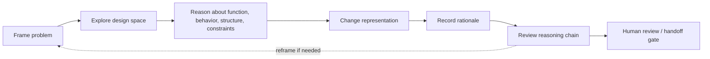

# Design Thinking Decomposition Rules

AI can produce fluent design text faster than teams can review the reasoning
behind it. This document turns design thinking into small reviewable operations
so the reasoning chain can be inspected before a candidate becomes a handoff
package.

It is a sanitized public pattern. It does not copy proprietary methods,
project-specific design records, customer templates, or paper bodies.

## Thinking Flow



## Core Operations

| Operation | Review question | Required evidence |
| --- | --- | --- |
| Frame | What problem is being solved, and what is out of scope? | frame statement, assumptions, stakeholders, validation target, reframe trigger |
| Explore | Which option families were considered or excluded? | option set, search method, rejection reasons, stop condition |
| Reason | How do function, behavior, structure, constraints, and evidence connect? | F/B/S chain, constraint table, allocation rationale, verification target |
| Represent | What changed when text became a diagram, table, model, work item, or code? | source, target, preserved semantics, omitted details, consistency check |
| Decide | Why was one option selected and others rejected? | issue, options, criteria, selected reason, rejected reasons, reopen trigger |
| Review | What claim was challenged and what repair closes it? | finding, counterexample or missing evidence, affected artifact, closure evidence |

## Rules

| Rule | Trigger | Required action | Gate effect |
| --- | --- | --- | --- |
| Explicit frame | A design activity, change request, reverse-engineering task, or AI draft starts. | State boundary, stakeholders, assumptions, excluded scope, validation target, and reframe trigger. | Block downstream drafting until the frame exists. |
| Problem-solution co-evolution | A solution exposes a better problem definition or invalidates a prior assumption. | Open a reframe decision and trace affected requirements, risks, criteria, and options. | Do not silently rewrite the problem. |
| Option-space visibility | Multiple architectures, algorithms, suppliers, tools, or implementation paths are plausible. | List option families, generation method, pruned options, stop criteria, and evaluation criteria. | Do not allow a trade decision from one unchallenged option. |
| Constraint authority | Constraints conflict or drive architecture, cost, safety, security, manufacturability, or service. | Classify hard/soft status, owner, authority, affected level, verification, and relaxation path. | Escalate unresolved hard-constraint conflicts. |
| F/B/S trace | A function, behavior, component, module, mechanism, or structure is proposed. | State function, expected behavior, selected structure, allocation rationale, and verification target. | Block acceptance until the chain is reviewable. |
| Abstraction move | Work moves from requirement to architecture, architecture to design, design to implementation, or evidence to gate. | Declare move type, parent, child, created interface, and evidence roll-up. | Open abstraction mismatch finding if hidden. |
| Representation preservation | Text is converted to diagram/model/table/work item/code, or model is converted to test/document. | Record preserved semantics, intentionally omitted detail, and consistency checks. | Require conversion review before handoff. |
| Rationale minimum | An option is selected, rejected, deferred, or reopened. | Record issue, options, criteria, selected/rejected reasons, assumptions, impact, and reopen trigger. | Require rationale before baseline or handoff. |
| Model validity boundary | A model, simulation, prototype, benchmark, or AI evaluation supports a decision. | Record purpose, input data, validity boundary, confidence, owner, and allowed decision use. | Do not use model result as proof outside its boundary. |
| AI role and authority | AI generates, critiques, transforms, retrieves, evaluates, or recommends design content. | Classify role, source basis, uncertainty, prohibited authority, and human gate. | Keep candidate-only until the boundary is reviewed. |
| Collaborative viewpoint | Multiple disciplines, suppliers, customer roles, reviewers, or agents influence a decision. | Record viewpoints, role contributions, conflicts, authority, and unresolved questions. | Escalate if a required viewpoint is missing. |
| Review as reasoning chain | A design artifact, AI output, or gate package is reviewed. | Convert comments into claim, missing evidence/counterexample, required repair, and closure evidence. | Checklist-only review cannot close the reasoning gate. |

## Failure Modes

| Failure | Effect | Detection | Repair |
| --- | --- | --- | --- |
| Solution-first design | Wrong problem is solved efficiently. | No stakeholder concern, boundary, or validation target before solution text. | Return to framing and record assumptions. |
| One-option exploration | Tradeoff looks cleaner than it is. | No rejected alternatives or stop criteria. | Generate option families or justify single-option constraint. |
| Constraint smudging | Decision criteria cannot be audited. | Authority, negotiability, owner, and conflict handling are unclear. | Split constraints and resolve contradictions. |
| Function/behavior/structure collapse | Implementation appears justified but purpose and verification are unclear. | Function, behavior, and structure are blended in one sentence/table. | Rewrite as F/B/S chain. |
| Representation loss | Assumptions, units, timing, exceptions, or rationale disappear. | Source and target representation disagree. | Add conversion note and missing semantic fields. |
| Silent reframe | Trace and approval history no longer match the real problem. | Current rationale contradicts the earlier frame. | Open reframe decision and update affected traces. |
| Model overtrust | Evidence is used outside its validity boundary. | Model result appears without boundary or calibration context. | Restrict use or add validation evidence. |
| Overconfident AI reasoning | Candidate content is treated as reliable without evidence. | No source basis, uncertainty, missing evidence, or human gate. | Mark candidate-only and add review questions. |
| Checklist-only review | Subtle framing, alternative, and evidence failures survive. | Findings are only OK/NG. | Convert findings into reasoning-chain records. |
| Voice collapse | Discipline-specific concerns vanish. | One summary approval hides missing viewpoints. | Record role-specific findings and conflicts. |

## Review Prompts

Use these prompts when reviewing AI-generated design content:

- What frame is being used, and what evidence would force a reframe?
- Which option families were considered, rejected, or never explored?
- Which constraints conflict, who owns them, and which are negotiable?
- Which function is realized by which behavior and structure?
- What abstraction move is being made, and what interface did it create?
- What semantics were lost when the representation changed?
- Why was each rejected option rejected?
- Where is the model valid, and for which decision may it be used?
- What does the AI not know, and what evidence would change the recommendation?
- What claim was challenged, and what closure evidence proves the repair?

## Agent Output Contract

When an AI agent recommends a design decision, require:

```text
Current frame:
Options considered:
Selected option:
Rejected options and why:
Constraints and conflicts:
F/B/S chain:
Representation changes:
Evidence and validity boundary:
Uncertainty and missing evidence:
Human review question:
```

The goal is not longer documents. The goal is to keep the reasoning inspectable
before the output becomes a local decision, trace candidate, gate candidate, or
handoff package.

## Boundary

This document supports:

- [docs/15_no_x_rule_pattern.md](15_no_x_rule_pattern.md)
- [docs/18_abstraction_levels_and_architecture_review.md](18_abstraction_levels_and_architecture_review.md)

It does not make a design correct, safe, compliant, or formally approved.
